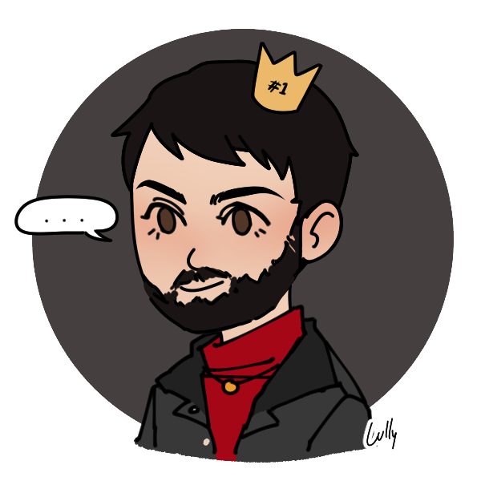
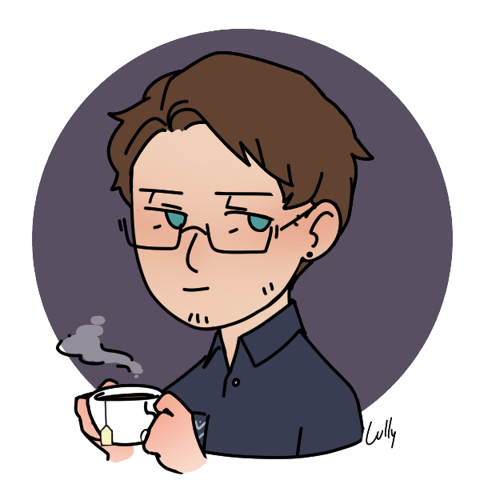

# Rainbow Six Extraction Wiki

>  A Project which focus in training languages using CSS, HTML and JavaScript; using the theme of the most recent game of the franchise Rainbow Six, called Rainbow Six: Extraction

### Goals:

- [x] Decide the pages design
- [x] Html Strutucture
- [x] Pages Features
- [ ] Working on CSS
- [ ] Additional Effects
- [ ] JavaScript

## 💜 About US

<table>
  <tr>
    <td align="center">
      <a href="#">
         
        
          <a href="https://github.com/Capamara"><b>Gabriel Amara</b></a>
        
      </a>
    </td>
    <td align="center">
      <a href="#">
         
        
           <a href="https://github.com/JoaoPorto23"><b>João Porto</b></a>
        
      </a>
    </td>
  </tr>
</table>

